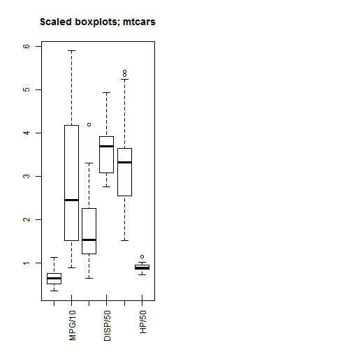
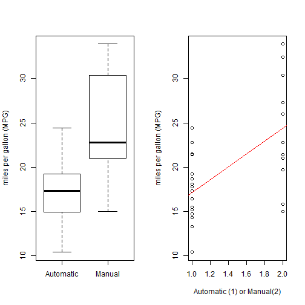

1. Summary

There is a set of variables related to miles per gallon (MPG) (outcome).

Here the difference of the MPG between automatic and manual transmissions is focused, the mtcars dataset in car package is taken as the data source, and techniques about regression models is used to solve the following two questions:

   (a) "whether an automatic or manual transmission better for MPG"
   (b) "Quantifying the different between the MPG automatic and manual transmissions?"

2 Part 2 of The Project
2.1 Load and Test Data

    The data was extracted from the 1974 Motor Trend US magazine, and comprises fuel consumption and 10 aspects of automobile design and performance for 32 automobiles (1973-74 models).


```r
library(datasets)
mpgData <- with(mtcars, data.frame(mpg, am))
mpgData$am <- factor(mpgData$am, labels = c("Automatic", "Manual"))
#summary(mpgData)
```

2.2 Data Processing 
2.2.1 (a): whether an automatic or manual transmission better for MPG?


```r
summary(mpgData[mpgData$am == "Automatic",])
```

```
##       mpg                am    
##  Min.   :10.40   Automatic:19  
##  1st Qu.:14.95   Manual   : 0  
##  Median :17.30                 
##  Mean   :17.15                 
##  3rd Qu.:19.20                 
##  Max.   :24.40
```

```r
summary(mpgData[mpgData$am == "Manual",])
```

```
##       mpg                am    
##  Min.   :15.00   Automatic: 0  
##  1st Qu.:21.00   Manual   :13  
##  Median :22.80                 
##  Mean   :24.39                 
##  3rd Qu.:30.40                 
##  Max.   :33.90
```

2.2.2 (b): Quantifying the different between the MPG automatic and manual transmissions?


```r
fit <- lm(mpg ~ as.integer(am), data=mpgData)
summary(fit)
```

```
## 
## Call:
## lm(formula = mpg ~ as.integer(am), data = mpgData)
## 
## Residuals:
##     Min      1Q  Median      3Q     Max 
## -9.3923 -3.0923 -0.2974  3.2439  9.5077 
## 
## Coefficients:
##                Estimate Std. Error t value Pr(>|t|)    
## (Intercept)       9.902      2.628   3.768 0.000720 ***
## as.integer(am)    7.245      1.764   4.106 0.000285 ***
## ---
## Signif. codes:  0 '***' 0.001 '**' 0.01 '*' 0.05 '.' 0.1 ' ' 1
## 
## Residual standard error: 4.902 on 30 degrees of freedom
## Multiple R-squared:  0.3598,	Adjusted R-squared:  0.3385 
## F-statistic: 16.86 on 1 and 30 DF,  p-value: 0.000285
```

---
3 Analysis

It appears that the manual transmission is better than automatic MPG, by of increased by 7.2449.
4 Appendix
3.1 Fig 1. MPG between automatic and manual transmissions


```r
par(mfrow = c(1, 2))
with(mtcars, boxplot(mpg/30, disp/80, hp/80, drat, wt, qsec/20, main = "Scaled boxplots; mtcars"), 
    xlab = "Continuous variable", ylab = "Scale (adjusted to allow simultaneous display")
axisnames <- c("MPG/10", "DISP/50", "HP/50", "drat", "wt", "qsec/5")
axis(1, at = c(2, 4, 6, 8, 10, 12), labels = axisnames, las = 2.5, cex.axis = 1.0, 
    tck = 0.05)
pairs(mtcars)
```

  

From scaled boxplots that the continuous variables are skew, and outlying values for horsepower, weight, and quarter mile speed. Transformations could be required. lets note from the Appendix that  categorical variables have sufficient frequencies in all cells for  regression models and are ordinal, so usable in linear models.  
Also lets examine bivariate plots of variables.The relationship between (automatic vs manual) transmission and fuel consumption ; manual transmissions yielding higher values of MPG.  However, there are  relationships between fuel consumption and other variables (cylinders, engine displacement, weight).  Transmission  looks to be correlated with some of these potential predictors, an important question is to what extent transmission independently affects fuel economy. 
Now ascertain whether fuel consumption differs between manual and automatic transmission cars, and quantify this.

---
Fig 2.

```r
par(mfrow=c(1,2))
with(mpgData,{
     boxplot(mpg ~ am, 
             ylab = "miles per gallon (MPG)")
     plot(mpg ~ as.integer(am),
             xlab = "Automatic (1) or Manual(2)",
             ylab = "miles per gallon (MPG)")
     abline(fit, col=2)
     })
```

 

Fig 3.

```r
mtcarsregmodel <- lm(mpg ~ am, data = mtcars)
summary(mtcarsregmodel)
```

```
## 
## Call:
## lm(formula = mpg ~ am, data = mtcars)
## 
## Residuals:
##     Min      1Q  Median      3Q     Max 
## -9.3923 -3.0923 -0.2974  3.2439  9.5077 
## 
## Coefficients:
##             Estimate Std. Error t value Pr(>|t|)    
## (Intercept)   17.147      1.125  15.247 1.13e-15 ***
## am             7.245      1.764   4.106 0.000285 ***
## ---
## Signif. codes:  0 '***' 0.001 '**' 0.01 '*' 0.05 '.' 0.1 ' ' 1
## 
## Residual standard error: 4.902 on 30 degrees of freedom
## Multiple R-squared:  0.3598,	Adjusted R-squared:  0.3385 
## F-statistic: 16.86 on 1 and 30 DF,  p-value: 0.000285
```

Transmission accounts for 36% of the variance in fuel consumption, that's statistically significantly better than chance (p < .0003). The intercept and slope coefficients shows that automatic transmissions achieve 17.147 miles per gallon fuel economy and that manual transmission cars achieve 24.39 miles per gallon fuel economy, on average.
These point estimates, are expressed at a 95% Confidence Intervals, for which we use the t.test method in R

---
4 Appendix
4.1 

```r
with(mtcars, table(cyl))
```

```
## cyl
##  4  6  8 
## 11  7 14
```


```r
with(mtcars, table(am))
```

```
## am
##  0  1 
## 19 13
```


```r
with(mtcars, table(gear))
```

```
## gear
##  3  4  5 
## 15 12  5
```


```r
with(mtcars, table(carb))
```

```
## carb
##  1  2  3  4  6  8 
##  7 10  3 10  1  1
```


```r
with(mtcars, table(vs))
```

```
## vs
##  0  1 
## 18 14
```

